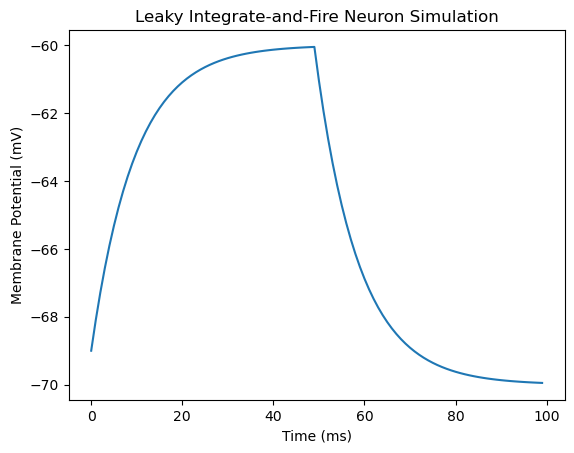

Group 3 - Alex Ramirez, Jackie Gore, Eva Duvaris, Steven Vacha, Ethan Chang

LIF Neuron Model:


```python
import numpy as np
import matplotlib.pyplot as plt

class LIFNeuron:
    def __init__(self, tau_m, tau_ref, v_rest, v_thresh):
        # Neuron parameters
        self.tau_m = tau_m  # Membrane time constant
        self.tau_ref = tau_ref  # Refractory period
        self.v_rest = v_rest  # Resting potential
        self.v_thresh = v_thresh  # Threshold potential

        # Neuron state variables
        self.membrane_potential = v_rest  # Initial membrane potential
        self.refractory_time = 0  # Initial refractory time

    def update(self, dt, current_input):
        # Check if the neuron is in a refractory period
        if self.refractory_time > 0:
            # Neuron is in refractory period, reset membrane potential to resting potential
            self.refractory_time -= dt
            self.membrane_potential = self.v_rest
        else:
            # Update membrane potential using leaky integration
            dv = (-(self.membrane_potential - self.v_rest) + current_input) / self.tau_m * dt
            self.membrane_potential += dv

            # Check for threshold crossing
            if self.membrane_potential >= self.v_thresh:
                # Neuron has fired, reset membrane potential to resting potential
                self.membrane_potential = self.v_rest
                # Set refractory period
                self.refractory_time = self.tau_ref

        # Return the updated membrane potential
        return self.membrane_potential
    
# Simulation parameters
tau_m = 10.0  # Membrane time constant (ms)
tau_ref = 2.0  # Refractory period (ms)
v_rest = -70.0  # Resting potential (mV)
v_thresh = -55.0  # Threshold potential (mV)
dt = 1.0  # Time step (ms)
sim_time = 100  # Simulation time (ms)

# Create LIF neuron
neuron = LIFNeuron(tau_m, tau_ref, v_rest, v_thresh)

# Simulation loop
time_points = np.arange(0, sim_time, dt)
membrane_potentials = []

for t in time_points:
    # Inject a constant input current for demonstration purposes
    input_current = 10.0 if t < 50 else 0.0

    # Update neuron and store membrane potential
    membrane_potential = neuron.update(dt, input_current)
    membrane_potentials.append(membrane_potential)

# Plot results
plt.plot(time_points, membrane_potentials)
plt.title('Leaky Integrate-and-Fire Neuron Simulation')
plt.xlabel('Time (ms)')
plt.ylabel('Membrane Potential (mV)')
plt.show()
```


    

    


a LIF model with voltage-gated sodium channel neuron
This model shows a simple electric circuit where the neurons "battery" has a resting voltage that changes when it recieves a signal aka a current. When this reaches a certain threshold it triggers the neuron to fire an electrical pulse aka an action potential then it resets back to it's resting voltage. In this specific neuron there is a channel called a voltage gated sodium channel that opens when the membrane potential meets a certain threshold, once the gate channel is open it allos sodium ions to flood in and spike membrane potential. The benefits of this model are in it's simplicity and ease to understand, it is also good for large networks of neuron models and long-term models. It also has a good deal of real biological basis and is good for modeling real neurons. However, its limitations come in the fact that it is too simple to truly capture the complexitity of biological neurons and it cannot model everything a biological neuron would do or things like adaptations. This model aslo does not account for percise spike timing and it is very sensitive to it's parameters such as the time constant. This model is simple, easy to make and understand but it is not very complex and cannot hold the same about of bits of information as a more complex model. 


```python
import numpy as np
import matplotlib.pyplot as plt

class LIFNeuron:
    def __init__(self, tau_m, tau_ref, v_rest, v_thresh, sodium_channel_params):
        # Neuron parameters
        self.tau_m = tau_m  # Membrane time constant
        self.tau_ref = tau_ref  # Refractory period
        self.v_rest = v_rest  # Resting potential
        self.v_thresh = v_thresh  # Threshold potential

        # Sodium channel parameters
        self.sodium_channel_params = sodium_channel_params
        self.m = 0.0  # Initial activation variable
        self.h = 1.0  # Initial inactivation variable

        # Neuron state variables
        self.membrane_potential = v_rest  # Initial membrane potential
        self.refractory_time = 0  # Initial refractory time

    def update_sodium_channel(self, dt):
        # Update sodium channel dynamics using Hodgkin-Huxley model
        alpha_m = self.sodium_channel_params['alpha_m'](self.membrane_potential)
        beta_m = self.sodium_channel_params['beta_m'](self.membrane_potential)
        alpha_h = self.sodium_channel_params['alpha_h'](self.membrane_potential)
        beta_h = self.sodium_channel_params['beta_h'](self.membrane_potential)

        dm_dt = alpha_m * (1 - self.m) - beta_m * self.m
        dh_dt = alpha_h * (1 - self.h) - beta_h * self.h

        self.m += dm_dt * dt
        self.h += dh_dt * dt

    def update(self, dt, current_input):
        # Check if the neuron is in a refractory period
        if self.refractory_time > 0:
            # Neuron is in refractory period, reset membrane potential to resting potential
            self.refractory_time -= dt
            self.membrane_potential = self.v_rest
        else:
            # Update sodium channel dynamics
            self.update_sodium_channel(dt)

            # Update membrane potential using leaky integration and sodium channel contribution
            dv = (-(self.membrane_potential - self.v_rest) + current_input + \
                  self.sodium_channel_params['g_Na'] * self.m**3 * self.h * \
                  (self.sodium_channel_params['E_Na'] - self.membrane_potential)) / self.tau_m * dt

            self.membrane_potential += dv

            # Check for threshold crossing
            if self.membrane_potential >= self.v_thresh:
                # Neuron has fired, reset membrane potential to resting potential
                self.membrane_potential = self.v_rest
                # Set refractory period
                self.refractory_time = self.tau_ref

        # Return the updated membrane potential
        return self.membrane_potential

# Sodium channel parameters (Hodgkin-Huxley model)
sodium_channel_params = {
    'alpha_m': lambda v: 0.1 * (v + 40) / (1 - np.exp(-(v + 40) / 10)),
    'beta_m': lambda v: 4.0 * np.exp(-(v + 65) / 18),
    'alpha_h': lambda v: 0.07 * np.exp(-(v + 65) / 20),
    'beta_h': lambda v: 1.0 / (1 + np.exp(-(v + 35) / 10)),
    'g_Na': 120.0,  # Sodium conductance (mS/cm^2)
    'E_Na': 50.0,   # Sodium reversal potential (mV)
}

# Simulation parameters
tau_m = 10.0  # Membrane time constant (ms)
tau_ref = 2.0  # Refractory period (ms)
v_rest = -70.0  # Resting potential (mV)
v_thresh = -55.0  # Threshold potential (mV)
dt = 0.1  # Time step (ms)
sim_time = 100  # Simulation time (ms)

# Create LIF neuron with sodium channels
neuron = LIFNeuron(tau_m, tau_ref, v_rest, v_thresh, sodium_channel_params)

# Simulation loop
time_points = np.arange(0, sim_time, dt)
membrane_potentials = []

for t in time_points:
    # Inject a step input current for demonstration purposes
    input_current = 10.0 if 20 < t < 100 else 0.0

    # Update neuron and store membrane potential
    membrane_potential = neuron.update(dt, input_current)
    membrane_potentials.append(membrane_potential)

# Plot results
plt.plot(time_points, membrane_potentials)
plt.title('Leaky Integrate-and-Fire Neuron with Sodium Channel (Multiple Spikes)')
plt.xlabel('Time (ms)')
plt.ylabel('Membrane Potential (mV)')
plt.show()

```


    

    


Simple nueral network model - open loop model


```python
import numpy as np
import networkx as nx
import matplotlib.pyplot as plt

class NeuralNetwork:
    def __init__(self, input_size, hidden_size, output_size):
        """
        Initialize the neural network with given input, hidden, and output layer sizes.
        
        Parameters:
        - input_size (int): Number of input neurons.
        - hidden_size (int): Number of neurons in the hidden layer.
        - output_size (int): Number of output neurons.
        """
        self.input_size = input_size
        self.hidden_size = hidden_size
        self.output_size = output_size
        
        # Initialize weights randomly with mean 0
        self.weights_input_hidden = np.random.randn(self.input_size, self.hidden_size)
        self.weights_hidden_output = np.random.randn(self.hidden_size, self.output_size)
        
    def forward(self, inputs):
        """
        Perform forward pass through the network.
        
        Parameters:
        - inputs (ndarray): Input data of shape (num_samples, input_size).
        
        Returns:
        - ndarray: Output of the network of shape (num_samples, output_size).
        """
        # Calculate activations of the hidden layer
        hidden_inputs = np.dot(inputs, self.weights_input_hidden)
        hidden_outputs = self.sigmoid(hidden_inputs)
        
        # Calculate activations of the output layer
        final_inputs = np.dot(hidden_outputs, self.weights_hidden_output)
        final_outputs = self.sigmoid(final_inputs)
        
        return final_outputs
    
    def sigmoid(self, x):
        """
        Sigmoid activation function.
        
        Parameters:
        - x (ndarray): Input to the function.
        
        Returns:
        - ndarray: Output after applying sigmoid function.
        """
        return 1 / (1 + np.exp(-x))

    def visualize(self):
        """
        Visualize the neural network architecture.
        """
        G = nx.DiGraph()
        G.add_nodes_from(['Input {}'.format(i) for i in range(self.input_size)], layer='Input')
        G.add_nodes_from(['Hidden {}'.format(i) for i in range(self.hidden_size)], layer='Hidden')
        G.add_nodes_from(['Output {}'.format(i) for i in range(self.output_size)], layer='Output')
        
        for i in range(self.input_size):
            for j in range(self.hidden_size):
                G.add_edge('Input {}'.format(i), 'Hidden {}'.format(j), weight=self.weights_input_hidden[i, j])
        
        for i in range(self.hidden_size):
            for j in range(self.output_size):
                G.add_edge('Hidden {}'.format(i), 'Output {}'.format(j), weight=self.weights_hidden_output[i, j])
        
        pos = nx.multipartite_layout(G, subset_key="layer")
        
        plt.figure(figsize=(8, 6))
        nx.draw(G, pos, with_labels=True, node_size=2000, node_color='skyblue', font_size=10, arrowsize=20)
        edge_labels = nx.get_edge_attributes(G, 'weight')
        nx.draw_networkx_edge_labels(G, pos, edge_labels=edge_labels, font_color='red')
        plt.title("Neural Network Architecture")
        plt.show()

# Example usage
input_size = 2
hidden_size = 3
output_size = 1

# Create a neural network with 2 input neurons, 3 hidden neurons, and 1 output neuron
model = NeuralNetwork(input_size, hidden_size, output_size)

# Visualize the network architecture
model.visualize()

```


    

    


```python
import numpy as np
import networkx as nx
import matplotlib.pyplot as plt

class NeuralNetwork:
    def __init__(self, input_size, hidden_size, output_size):
        """
        Initialize the neural network with given input, hidden, and output layer sizes.
        
        Parameters:
        - input_size (int): Number of input neurons.
        - hidden_size (int): Number of neurons in the hidden layer.
        - output_size (int): Number of output neurons.
        """
        self.input_size = input_size
        self.hidden_size = hidden_size
        self.output_size = output_size
        
        # Initialize weights randomly with mean 0
        self.weights_input_hidden = np.random.randn(self.input_size, self.hidden_size)
        self.weights_hidden_output = np.random.randn(self.hidden_size, self.output_size)
        
    def forward(self, inputs):
        """
        Perform forward pass through the network.
        
        Parameters:
        - inputs (ndarray): Input data of shape (num_samples, input_size).
        
        Returns:
        - ndarray: Output of the network of shape (num_samples, output_size).
        """
        # Calculate activations of the hidden layer
        hidden_inputs = np.dot(inputs, self.weights_input_hidden)
        hidden_outputs = self.sigmoid(hidden_inputs)
        
        # Calculate activations of the output layer
        final_inputs = np.dot(hidden_outputs, self.weights_hidden_output)
        final_outputs = self.sigmoid(final_inputs)
        
        return final_outputs
    
    def sigmoid(self, x):
        """
        Sigmoid activation function.
        
        Parameters:
        - x (ndarray): Input to the function.
        
        Returns:
        - ndarray: Output after applying sigmoid function.
        """
        return 1 / (1 + np.exp(-x))
    
    def visualize(self):
        """
        Visualize the neural network architecture using networkx and matplotlib.
        """
        G = nx.DiGraph()

        # Add nodes for each layer
        G.add_nodes_from(range(self.input_size), layer='Input')
        G.add_nodes_from(range(self.input_size, self.input_size + self.hidden_size), layer='Hidden')
        G.add_nodes_from(range(self.input_size + self.hidden_size, self.input_size + self.hidden_size + self.output_size), layer='Output')

        # Add edges between layers
        for i in range(self.input_size):
            for j in range(self.hidden_size):
                G.add_edge(i, self.input_size + j, weight=self.weights_input_hidden[i, j])
        
        for i in range(self.hidden_size):
            for j in range(self.output_size):
                G.add_edge(self.input_size + i, self.input_size + self.hidden_size + j, weight=self.weights_hidden_output[i, j])
        
        # Specify the node positions
        pos = nx.multipartite_layout(G, subset_key="layer")

        # Draw the neural network
        plt.figure(figsize=(10, 6))
        nx.draw(G, pos, with_labels=True, node_size=1000, node_color='skyblue', font_size=12, arrowsize=20)
        edge_labels = {(i, j): '{:.2f}'.format(d['weight']) for i, j, d in G.edges(data=True)}
        nx.draw_networkx_edge_labels(G, pos, edge_labels=edge_labels, font_color='red', font_size=10)
        plt.title("Neural Network Architecture")
        plt.show()

# Example usage
input_size = 2
hidden_size = 3
output_size = 1

# Create a neural network with 2 input neurons, 3 hidden neurons, and 1 output neuron
model = NeuralNetwork(input_size, hidden_size, output_size)

# Visualize the network architecture
model.visualize()


```

    

    


```python

```
**Cat Fact**: The wealtheist cat in the world was named blackie and inherited 7 million dollars from his owner after he died, However Taylor swifts cat has an estimated 97 million in assets!
