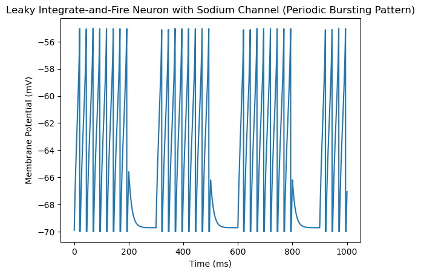

Group 3 - Alex Ramirez, Jackie Gore, Eva Duvaris, Steven Vacha, Ethan Chang

***LIF Neuron Model:***


```python
import numpy as np
import matplotlib.pyplot as plt

class LIFNeuron:
    def __init__(self, tau_m, tau_ref, v_rest, v_thresh):
        # Neuron parameters
        self.tau_m = tau_m  # Membrane time constant
        self.tau_ref = tau_ref  # Refractory period
        self.v_rest = v_rest  # Resting potential
        self.v_thresh = v_thresh  # Threshold potential

        # Neuron state variables
        self.membrane_potential = v_rest  # Initial membrane potential
        self.refractory_time = 0  # Initial refractory time

    def update(self, dt, current_input):
        # Check if the neuron is in a refractory period
        if self.refractory_time > 0:
            # Neuron is in refractory period, reset membrane potential to resting potential
            self.refractory_time -= dt
            self.membrane_potential = self.v_rest
        else:
            # Update membrane potential using leaky integration
            dv = (-(self.membrane_potential - self.v_rest) + current_input) / self.tau_m * dt
            self.membrane_potential += dv

            # Check for threshold crossing
            if self.membrane_potential >= self.v_thresh:
                # Neuron has fired, reset membrane potential to resting potential
                self.membrane_potential = self.v_rest
                # Set refractory period
                self.refractory_time = self.tau_ref

        # Return the updated membrane potential
        return self.membrane_potential
    
# Simulation parameters
tau_m = 10.0  # Membrane time constant (ms)
tau_ref = 2.0  # Refractory period (ms)
v_rest = -70.0  # Resting potential (mV)
v_thresh = -55.0  # Threshold potential (mV)
dt = 1.0  # Time step (ms)
sim_time = 100  # Simulation time (ms)

# Create LIF neuron
neuron = LIFNeuron(tau_m, tau_ref, v_rest, v_thresh)

# Simulation loop
time_points = np.arange(0, sim_time, dt)
membrane_potentials = []

for t in time_points:
    # Inject a constant input current for demonstration purposes
    input_current = 10.0 if t < 50 else 0.0

    # Update neuron and store membrane potential
    membrane_potential = neuron.update(dt, input_current)
    membrane_potentials.append(membrane_potential)

# Plot results
plt.plot(time_points, membrane_potentials)
plt.title('Leaky Integrate-and-Fire Neuron Simulation')
plt.xlabel('Time (ms)')
plt.ylabel('Membrane Potential (mV)')
plt.show()
```


    

    


***a LIF model with voltage-gated sodium channel neuron***


This model shows a simple electric circuit where the neurons "battery" has a resting voltage that changes when it recieves a signal aka a current. When this reaches a certain threshold it triggers the neuron to fire an electrical pulse aka an action potential then it resets back to it's resting voltage. In this specific neuron there is a channel called a voltage gated sodium channel that opens when the membrane potential meets a certain threshold, once the gate channel is open it allos sodium ions to flood in and spike membrane potential. The benefits of this model are in it's simplicity and ease to understand, it is also good for large networks of neuron models and long-term models. It also has a good deal of real biological basis and is good for modeling real neurons. However, its limitations come in the fact that it is too simple to truly capture the complexitity of biological neurons and it cannot model everything a biological neuron would do or things like adaptations. This model aslo does not account for percise spike timing and it is very sensitive to it's parameters such as the time constant. This model is simple, easy to make and understand but it is not very complex and cannot hold the same about of bits of information as a more complex model. 


```python
import numpy as np
import matplotlib.pyplot as plt

class LIFNeuron:
    def __init__(self, tau_m, tau_ref, v_rest, v_thresh, sodium_channel_params):
        # Neuron parameters
        self.tau_m = tau_m  # Membrane time constant
        self.tau_ref = tau_ref  # Refractory period
        self.v_rest = v_rest  # Resting potential
        self.v_thresh = v_thresh  # Threshold potential

        # Sodium channel parameters
        self.sodium_channel_params = sodium_channel_params
        self.m = 0.0  # Initial activation variable
        self.h = 1.0  # Initial inactivation variable

        # Neuron state variables
        self.membrane_potential = v_rest  # Initial membrane potential
        self.refractory_time = 0  # Initial refractory time

    def update_sodium_channel(self, dt):
        # Update sodium channel dynamics using Hodgkin-Huxley model
        alpha_m = self.sodium_channel_params['alpha_m'](self.membrane_potential)
        beta_m = self.sodium_channel_params['beta_m'](self.membrane_potential)
        alpha_h = self.sodium_channel_params['alpha_h'](self.membrane_potential)
        beta_h = self.sodium_channel_params['beta_h'](self.membrane_potential)

        dm_dt = alpha_m * (1 - self.m) - beta_m * self.m
        dh_dt = alpha_h * (1 - self.h) - beta_h * self.h

        self.m += dm_dt * dt
        self.h += dh_dt * dt

    def update(self, dt, current_input):
        # Check if the neuron is in a refractory period
        if self.refractory_time > 0:
            # Neuron is in refractory period, reset membrane potential to resting potential
            self.refractory_time -= dt
            self.membrane_potential = self.v_rest
        else:
            # Update sodium channel dynamics
            self.update_sodium_channel(dt)

            # Update membrane potential using leaky integration and sodium channel contribution
            dv = (-(self.membrane_potential - self.v_rest) + current_input + \
                  self.sodium_channel_params['g_Na'] * self.m**3 * self.h * \
                  (self.sodium_channel_params['E_Na'] - self.membrane_potential)) / self.tau_m * dt

            self.membrane_potential += dv

            # Check for threshold crossing
            if self.membrane_potential >= self.v_thresh:
                # Neuron has fired, reset membrane potential to resting potential
                self.membrane_potential = self.v_rest
                # Set refractory period
                self.refractory_time = self.tau_ref

        # Return the updated membrane potential
        return self.membrane_potential

# Sodium channel parameters (Hodgkin-Huxley model)
sodium_channel_params = {
    'alpha_m': lambda v: 0.1 * (v + 40) / (1 - np.exp(-(v + 40) / 10)),
    'beta_m': lambda v: 4.0 * np.exp(-(v + 65) / 18),
    'alpha_h': lambda v: 0.07 * np.exp(-(v + 65) / 20),
    'beta_h': lambda v: 1.0 / (1 + np.exp(-(v + 35) / 10)),
    'g_Na': 120.0,  # Sodium conductance (mS/cm^2)
    'E_Na': 50.0,   # Sodium reversal potential (mV)
}

# Simulation parameters
tau_m = 10.0  # Membrane time constant (ms)
tau_ref = 2.0  # Refractory period (ms)
v_rest = -70.0  # Resting potential (mV)
v_thresh = -55.0  # Threshold potential (mV)
dt = 0.1  # Time step (ms)
sim_time = 100  # Simulation time (ms)

# Create LIF neuron with sodium channels
neuron = LIFNeuron(tau_m, tau_ref, v_rest, v_thresh, sodium_channel_params)

# Simulation loop
time_points = np.arange(0, sim_time, dt)
membrane_potentials = []

for t in time_points:
    # Inject a step input current for demonstration purposes
    input_current = 10.0 if 20 < t < 100 else 0.0

    # Update neuron and store membrane potential
    membrane_potential = neuron.update(dt, input_current)
    membrane_potentials.append(membrane_potential)

# Plot results
plt.plot(time_points, membrane_potentials)
plt.title('Leaky Integrate-and-Fire Neuron with Sodium Channel (Multiple Spikes)')
plt.xlabel('Time (ms)')
plt.ylabel('Membrane Potential (mV)')
plt.show()

```


    

    


***Simple nueral network model - open loop model***


```python
import numpy as np
import networkx as nx
import matplotlib.pyplot as plt

class NeuralNetwork:
    def __init__(self, input_size, hidden_size, output_size):
        """
        Initialize the neural network with given input, hidden, and output layer sizes.
        
        Parameters:
        - input_size (int): Number of input neurons.
        - hidden_size (int): Number of neurons in the hidden layer.
        - output_size (int): Number of output neurons.
        """
        self.input_size = input_size
        self.hidden_size = hidden_size
        self.output_size = output_size
        
        # Initialize weights randomly with mean 0
        self.weights_input_hidden = np.random.randn(self.input_size, self.hidden_size)
        self.weights_hidden_output = np.random.randn(self.hidden_size, self.output_size)
        
    def forward(self, inputs):
        """
        Perform forward pass through the network.
        
        Parameters:
        - inputs (ndarray): Input data of shape (num_samples, input_size).
        
        Returns:
        - ndarray: Output of the network of shape (num_samples, output_size).
        """
        # Calculate activations of the hidden layer
        hidden_inputs = np.dot(inputs, self.weights_input_hidden)
        hidden_outputs = self.sigmoid(hidden_inputs)
        
        # Calculate activations of the output layer
        final_inputs = np.dot(hidden_outputs, self.weights_hidden_output)
        final_outputs = self.sigmoid(final_inputs)
        
        return final_outputs
    
    def sigmoid(self, x):
        """
        Sigmoid activation function.
        
        Parameters:
        - x (ndarray): Input to the function.
        
        Returns:
        - ndarray: Output after applying sigmoid function.
        """
        return 1 / (1 + np.exp(-x))

    def visualize(self):
        """
        Visualize the neural network architecture.
        """
        G = nx.DiGraph()
        G.add_nodes_from(['Input {}'.format(i) for i in range(self.input_size)], layer='Input')
        G.add_nodes_from(['Hidden {}'.format(i) for i in range(self.hidden_size)], layer='Hidden')
        G.add_nodes_from(['Output {}'.format(i) for i in range(self.output_size)], layer='Output')
        
        for i in range(self.input_size):
            for j in range(self.hidden_size):
                G.add_edge('Input {}'.format(i), 'Hidden {}'.format(j), weight=self.weights_input_hidden[i, j])
        
        for i in range(self.hidden_size):
            for j in range(self.output_size):
                G.add_edge('Hidden {}'.format(i), 'Output {}'.format(j), weight=self.weights_hidden_output[i, j])
        
        pos = nx.multipartite_layout(G, subset_key="layer")
        
        plt.figure(figsize=(8, 6))
        nx.draw(G, pos, with_labels=True, node_size=2000, node_color='skyblue', font_size=10, arrowsize=20)
        edge_labels = nx.get_edge_attributes(G, 'weight')
        nx.draw_networkx_edge_labels(G, pos, edge_labels=edge_labels, font_color='red')
        plt.title("Neural Network Architecture")
        plt.show()

# Example usage
input_size = 2
hidden_size = 3
output_size = 1

# Create a neural network with 2 input neurons, 3 hidden neurons, and 1 output neuron
model = NeuralNetwork(input_size, hidden_size, output_size)

# Visualize the network architecture
model.visualize()

```


    

    


```python
import numpy as np
import networkx as nx
import matplotlib.pyplot as plt

class NeuralNetwork:
    def __init__(self, input_size, hidden_size, output_size):
        """
        Initialize the neural network with given input, hidden, and output layer sizes.
        
        Parameters:
        - input_size (int): Number of input neurons.
        - hidden_size (int): Number of neurons in the hidden layer.
        - output_size (int): Number of output neurons.
        """
        self.input_size = input_size
        self.hidden_size = hidden_size
        self.output_size = output_size
        
        # Initialize weights randomly with mean 0
        self.weights_input_hidden = np.random.randn(self.input_size, self.hidden_size)
        self.weights_hidden_output = np.random.randn(self.hidden_size, self.output_size)
        
    def forward(self, inputs):
        """
        Perform forward pass through the network.
        
        Parameters:
        - inputs (ndarray): Input data of shape (num_samples, input_size).
        
        Returns:
        - ndarray: Output of the network of shape (num_samples, output_size).
        """
        # Calculate activations of the hidden layer
        hidden_inputs = np.dot(inputs, self.weights_input_hidden)
        hidden_outputs = self.sigmoid(hidden_inputs)
        
        # Calculate activations of the output layer
        final_inputs = np.dot(hidden_outputs, self.weights_hidden_output)
        final_outputs = self.sigmoid(final_inputs)
        
        return final_outputs
    
    def sigmoid(self, x):
        """
        Sigmoid activation function.
        
        Parameters:
        - x (ndarray): Input to the function.
        
        Returns:
        - ndarray: Output after applying sigmoid function.
        """
        return 1 / (1 + np.exp(-x))
    
    def visualize(self):
        """
        Visualize the neural network architecture using networkx and matplotlib.
        """
        G = nx.DiGraph()

        # Add nodes for each layer
        G.add_nodes_from(range(self.input_size), layer='Input')
        G.add_nodes_from(range(self.input_size, self.input_size + self.hidden_size), layer='Hidden')
        G.add_nodes_from(range(self.input_size + self.hidden_size, self.input_size + self.hidden_size + self.output_size), layer='Output')

        # Add edges between layers
        for i in range(self.input_size):
            for j in range(self.hidden_size):
                G.add_edge(i, self.input_size + j, weight=self.weights_input_hidden[i, j])
        
        for i in range(self.hidden_size):
            for j in range(self.output_size):
                G.add_edge(self.input_size + i, self.input_size + self.hidden_size + j, weight=self.weights_hidden_output[i, j])
        
        # Specify the node positions
        pos = nx.multipartite_layout(G, subset_key="layer")

        # Draw the neural network
        plt.figure(figsize=(10, 6))
        nx.draw(G, pos, with_labels=True, node_size=1000, node_color='skyblue', font_size=12, arrowsize=20)
        edge_labels = {(i, j): '{:.2f}'.format(d['weight']) for i, j, d in G.edges(data=True)}
        nx.draw_networkx_edge_labels(G, pos, edge_labels=edge_labels, font_color='red', font_size=10)
        plt.title("Neural Network Architecture")
        plt.show()

# Example usage
input_size = 2
hidden_size = 3
output_size = 1

# Create a neural network with 2 input neurons, 3 hidden neurons, and 1 output neuron
model = NeuralNetwork(input_size, hidden_size, output_size)

# Visualize the network architecture
model.visualize()


```

    

    

***Model Comparisons:***


An LIF model (Leaky integrate and fire model) is a model in which the behavior of a neuron is simulated as a measure of membrane potential over time. The benefits include its simplicity in implementation when attempting to model biological neuron behavior. Though simple in design, the LIF model can often oversimplify biological neuronal function and may fail to account for changes in threshold, synaptic plasticity, etc.


An LIF model with a voltage-gated sodium channel factored in operates in the same way, but more accurately models the workings of an action potential with the rapid depolarization and refractory model. As a result, benefits of using the model include its ability to better model an action potential including the cell's ability to excite and fire. A major limitation, however, is its increased complexity and strain on computing power. In addition, it can be slow and inefficient to compute large-scale networks, as it involves more information than a simple LIF model.


Simple neural networks are computational models that are more concerned with the interconnectedness of neurons in the brain and utilize nodes organized into layers to compute data. Benefits of using this model include its ability to take in a variety of different data depending on how many layers the model has while being able to process more than one stream of information at once through parallel processing. Limitations of such a model include difficulties interpreting the hidden layer in between the input and output in addition to the large amounts of data that are needed to train the model to compute effectively. Artificial neural networks are more functional for utility in machine learning and natural language processing than they are for biological realism.


Overall, simple neural networks are the most complex and contain the most bits of information. Simple neural networks can contain multiple hidden layers that better represent the complexity of the factors that contribute to neural connections between 2 cells. Even if LIF models contain voltage-gated sodium channels to better represent the transmission of action potentials and depolarization of the cell to reach threshold, it still doesn't model other factors that can contribute to the communication of information between cells such as summation of graded potentials, threshold changes, etc. Furthermore, simple neural networks are ANNs and DNN that allow for feature detection, which allows it to learn from its own programming while processing vast amounts of information. In comparison, both LIF models do not reach the complexity of ANN and cannot process or adapt to the vast amounts of information that may be inputted into the model.


The LIF model without voltage-gated sodium channels is more concise as it is the least complex. LIF models simply integrate signals and produce an action potential spike when threshold is met. Compared to the other two models that are able to integrate more information and better model the behavior of neural connections, the simple LIF model is the most concise as its computational capabilities are the simplest.


***What if inputs to LIF model come in bursting patterns?***

```python
import numpy as np
import matplotlib.pyplot as plt

class LIFNeuron:
    def __init__(self, tau_m, tau_ref, v_rest, v_thresh, sodium_channel_params):
        # Neuron parameters
        self.tau_m = tau_m  # Membrane time constant
        self.tau_ref = tau_ref  # Refractory period
        self.v_rest = v_rest  # Resting potential
        self.v_thresh = v_thresh  # Threshold potential

        # Sodium channel parameters
        self.sodium_channel_params = sodium_channel_params
        self.m = 0.0  # Initial activation variable
        self.h = 1.0  # Initial inactivation variable

        # Neuron state variables
        self.membrane_potential = v_rest  # Initial membrane potential
        self.refractory_time = 0  # Initial refractory time

    def update_sodium_channel(self, dt):
        # Update sodium channel dynamics using Hodgkin-Huxley model
        alpha_m = self.sodium_channel_params['alpha_m'](self.membrane_potential)
        beta_m = self.sodium_channel_params['beta_m'](self.membrane_potential)
        alpha_h = self.sodium_channel_params['alpha_h'](self.membrane_potential)
        beta_h = self.sodium_channel_params['beta_h'](self.membrane_potential)

        dm_dt = alpha_m * (1 - self.m) - beta_m * self.m
        dh_dt = alpha_h * (1 - self.h) - beta_h * self.h

        self.m += dm_dt * dt
        self.h += dh_dt * dt

    def update(self, dt, current_input):
        # Check if the neuron is in a refractory period
        if self.refractory_time > 0:
            # Neuron is in refractory period, reset membrane potential to resting potential
            self.refractory_time -= dt
            self.membrane_potential = self.v_rest
        else:
            # Update sodium channel dynamics
            self.update_sodium_channel(dt)

            # Update membrane potential using leaky integration and sodium channel contribution
            dv = (-(self.membrane_potential - self.v_rest) + current_input + \
                  self.sodium_channel_params['g_Na'] * self.m**3 * self.h * \
                  (self.sodium_channel_params['E_Na'] - self.membrane_potential)) / self.tau_m * dt

            self.membrane_potential += dv

            # Check for threshold crossing
            if self.membrane_potential >= self.v_thresh:
                # Neuron has fired, reset membrane potential to resting potential
                self.membrane_potential = self.v_rest
                # Set refractory period
                self.refractory_time = self.tau_ref

        # Return the updated membrane potential
        return self.membrane_potential

# Sodium channel parameters (Hodgkin-Huxley model)
sodium_channel_params = {
    'alpha_m': lambda v: 0.1 * (v + 40) / (1 - np.exp(-(v + 40) / 10)),
    'beta_m': lambda v: 4.0 * np.exp(-(v + 65) / 18),
    'alpha_h': lambda v: 0.07 * np.exp(-(v + 65) / 20),
    'beta_h': lambda v: 1.0 / (1 + np.exp(-(v + 35) / 10)),
    'g_Na': 120.0,  # Sodium conductance (mS/cm^2)
    'E_Na': 50.0,   # Sodium reversal potential (mV)
}

# Simulation parameters
tau_m = 10.0  # Membrane time constant (ms)
tau_ref = 2.0  # Refractory period (ms)
v_rest = -70.0  # Resting potential (mV)
v_thresh = -55.0  # Threshold potential (mV)
dt = 0.1  # Time step (ms)
sim_time = 1000  # Simulation time (ms)
burst_period = 200  # Burst period (ms)
quiescent_period = 100  # Quiescent period (ms)

# Create LIF neuron with sodium channels
neuron = LIFNeuron(tau_m, tau_ref, v_rest, v_thresh, sodium_channel_params)

# Simulation loop
time_points = np.arange(0, sim_time, dt)
membrane_potentials = []

for t in time_points:
    # Determine input current based on bursting or quiescent period
    if t % (burst_period + quiescent_period) < burst_period:
        input_current = 10.0  # High input current during bursting period
    else:
        input_current = 0.0  # No input current during quiescent period

    # Update neuron and store membrane potential
    membrane_potential = neuron.update(dt, input_current)
    membrane_potentials.append(membrane_potential)

# Plot results
plt.plot(time_points, membrane_potentials)
plt.title('Leaky Integrate-and-Fire Neuron with Sodium Channel (Periodic Bursting Pattern)')
plt.xlabel('Time (ms)')
plt.ylabel('Membrane Potential (mV)')
plt.show()

```



***What happens if graded potentials don't sum to threshold?***


```python
import numpy as np
import matplotlib.pyplot as plt

class LIFNeuron:
    def __init__(self, tau_m, tau_ref, v_rest, v_thresh, sodium_channel_params):
        # Neuron parameters
        self.tau_m = tau_m  # Membrane time constant
        self.tau_ref = tau_ref  # Refractory period
        self.v_rest = v_rest  # Resting potential
        self.v_thresh = v_thresh  # Threshold potential

        # Sodium channel parameters
        self.sodium_channel_params = sodium_channel_params
        self.m = 0.0  # Initial activation variable
        self.h = 1.0  # Initial inactivation variable

        # Neuron state variables
        self.membrane_potential = v_rest  # Initial membrane potential
        self.refractory_time = 0  # Initial refractory time

    def update_sodium_channel(self, dt):
        # Update sodium channel dynamics using Hodgkin-Huxley model
        alpha_m = self.sodium_channel_params['alpha_m'](self.membrane_potential)
        beta_m = self.sodium_channel_params['beta_m'](self.membrane_potential)
        alpha_h = self.sodium_channel_params['alpha_h'](self.membrane_potential)
        beta_h = self.sodium_channel_params['beta_h'](self.membrane_potential)

        dm_dt = alpha_m * (1 - self.m) - beta_m * self.m
        dh_dt = alpha_h * (1 - self.h) - beta_h * self.h

        self.m += dm_dt * dt
        self.h += dh_dt * dt

    def update(self, dt, current_input):
        # Check if the neuron is in a refractory period
        if self.refractory_time > 0:
            # Neuron is in refractory period, reset membrane potential to resting potential
            self.refractory_time -= dt
            self.membrane_potential = self.v_rest
        else:
            # Update sodium channel dynamics
            self.update_sodium_channel(dt)

            # Update membrane potential using leaky integration and sodium channel contribution
            dv = (-(self.membrane_potential - self.v_rest) + current_input + \
                  self.sodium_channel_params['g_Na'] * self.m**3 * self.h * \
                  (self.sodium_channel_params['E_Na'] - self.membrane_potential)) / self.tau_m * dt

            self.membrane_potential += dv

            # Check for threshold crossing
            if self.membrane_potential >= self.v_thresh:
                # Neuron has fired, reset membrane potential to resting potential
                self.membrane_potential = self.v_rest
                # Set refractory period
                self.refractory_time = self.tau_ref

        # Return the updated membrane potential
        return self.membrane_potential

# Sodium channel parameters (Hodgkin-Huxley model)
sodium_channel_params = {
    'alpha_m': lambda v: 0.1 * (v + 40) / (1 - np.exp(-(v + 40) / 10)),
    'beta_m': lambda v: 4.0 * np.exp(-(v + 65) / 18),
    'alpha_h': lambda v: 0.07 * np.exp(-(v + 65) / 20),
    'beta_h': lambda v: 1.0 / (1 + np.exp(-(v + 35) / 10)),
    'g_Na': 120.0,  # Sodium conductance (mS/cm^2)
    'E_Na': 50.0,   # Sodium reversal potential (mV)
}

# Simulation parameters
tau_m = 10.0  # Membrane time constant (ms)
tau_ref = 2.0  # Refractory period (ms)
v_rest = -75.0  # Resting potential (mV) - hyperpolarization
v_thresh = -55.0  # Threshold potential (mV)
dt = 0.1  # Time step (ms)
sim_time = 800  # Simulation time (ms)

# Create LIF neuron with sodium channels
neuron = LIFNeuron(tau_m, tau_ref, v_rest, v_thresh, sodium_channel_params)

# Simulation loop
time_points = np.arange(0, sim_time, dt)
membrane_potentials = []

for t in time_points:
    # Inject input current with different amplitudes
    if 20 <= t < 250:
        input_current = np.random.choice([5.0, 10.0])  # Random input currents below and above threshold
    elif 250 <= t < 300:
        input_current = 5.0  # Graded potential below threshold
    elif 300 <= t < 350:
        input_current = 10.0  # Step input current to trigger spike
    elif 750 <= t < 800:
        input_current = 10.0  # Step input current to trigger spike
    else:
        input_current = 0.0  # No input current

    # Update neuron and store membrane potential
    membrane_potential = neuron.update(dt, input_current)
    membrane_potentials.append(membrane_potential)

# Plot results
plt.plot(time_points, membrane_potentials)
plt.title('Leaky Integrate-and-Fire Neuron with Sodium Channel (Hyperpolarization at Beginning)')
plt.xlabel('Time (ms)')
plt.ylabel('Membrane Potential (mV)')
plt.show()
```


***What is Shannon Entropy?***
Shannon Entropy is defined as the amount of uncertainty involved in the value of a random variable or process. It is represented using the equation below:

P(x) is the probability of the event x occurring. The sum is taken over all of the possible events x in the sample space.
What does entropy mean in the context of information theory?

In the context of information theory, entropy quantifies the uncertainty associated with a source/system of information. The higher the entropy, the more unpredictable the system is. This uncertainty is a result of the variability in the occurrence of different symbols or characters within the data. It becomes harder to predict the outcome of any event due to the diversity of symbols and characters present within the data. 
Shannon entropy is calculated based on the average distribution of characters or symbols in the data source. Shannon entropy will take into account how often each character or symbol is present in the data. Shorter codes will be assigned to more frequent characters whereas longer codes will be assigned to less frequent characters, thereby achieving optimal efficiency. 

How does this relate to encoding efficiency?

An encoding scheme is a method by which data is represented in a compact form. The efficiency of encoding schemes is determined by how far the data can be compressed while retaining all of its information. Shannon entropy provides a theoretical limit on the efficiency of encoding schemes, which is defined as the variable H. If there was high Shannon entropy within a source of information, there would be greater uncertainty and the encoding scheme would need to use more bits on average per symbol in order to retain all of the information.

Can you give a practical example?

Suppose we have a bag of 10 uniquely colored marbles, each having the same probability of being picked. What is the most efficient way to represent the color of each marble using bits?

Since there are 10 colors, we could potentially use 4 bits to represent all of the colors. 2^4 = 16, which is greater than 10. However, this would be inefficient as we would have 6 unused states (16-10 = 6). 
An alternative solution would be to group the marbles into sets of 3, and then assign bits to represent each set of marbles. With 3 marbles in each group, we will have 10^3 = 1000 possible combinations of colors. In order to represent 1000 combinations, we would need to calculate log2(1000), which is approximately 10 bits. With 10 bits, we are able to efficiently encode the color combination of the marbles. Because we grouped the marbles into sets of 3, each marble can be represented by 10/3 bits, which is approximately 3.333 bits. Ideally, the most efficient way to represent the number of color combinations would be log2(10) (3.32 bits), due to the fact that if we have n equally likely outcomes, the entropy will be log2(n) bits. 


```python

```
**Cat Fact**: The wealtheist cat in the world was named blackie and inherited 7 million dollars from his owner after he died, However Taylor swifts cat has an estimated 97 million in assets!
